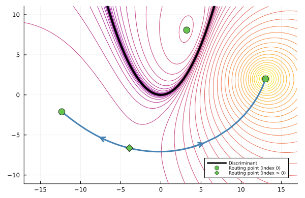

# ProjectedHypersurfaces.jl
[](https://oskarhenriksson.github.io/ProjectedHypersurfaces.jl/dev/)
[](https://github.com/oskarhenriksson/ProjectedHypersurfaces.jl/actions/workflows/ci.yml)

This repository implements "numerical elimination" techniques for representing, and computing the complement of, real hypersurfaces that arise through projection of a known variety.

It is based on the paper [Elimination Without Eliminating: Computing Complements of Real Hypersurfaces Using Pseudo-Witness Sets](https://arxiv.org/abs/2601.04383) by Paul Breiding, John Cobb, Aviva Englander, Nayda Farnsworth, Jon Hauenstein, Oskar Henriksson, David Johnson, Jordy Lopez Garcia, and Deepak Mundayur.

## Installation

You can install the package directly from the github repository as follows:

```julia-repl
julia> using Pkg
julia> Pkg.add(url="https://github.com/oskarhenriksson/ProjectedHypersurfaces.jl")
```
To use the package, make sure that you have activated a Julia environment where the package is added. 

You can then load the package in a Julia session by running the following command:

```julia-repl
julia> using ProjectedHypersurfaces
```

## Examples of usage

As a case study, suppose that we want to study the complement of the discriminant for the quadratic polynomial 
```math
f_{a,b}(x)=x^2+ax+b
``` 
with parameters $a$ and $b$.

We start by setting up the incidence variety $`\{(a,b,x)\in ℂ^3\mid f_{a,b}(x)=f′_{a,b}(x)=0\}`$ of the discriminant, which we use to form a `ProjectedHypersurface` that represents the discrimiminant via a pseudo-witness set.

```julia-repl
julia> @var a b x;
julia> F = System([x^2 + a * x + b, 2x + a], variables = [a, b, x]);
julia> h = ProjectedHypersurface(F, [a, b])
Projected hypersurface of degree 2 in ambient dimension 2
```

### Degree
We can extract the degree of the hypersurface as follows:

```julia-repl
julia> degree(h)
2
```

### Trace test
To verify the completeness of the pseudowitness set (and hence the correctness of the degree), we can run a *trace test*. Theoretically, this value is zero if and only if the pseudowitness set is complete. Hence, a value close to machine precision is strong evidence (albeit not a certificate) of completeness.

```julia-repl
julia> trace_test(h)
1.4101715336057762e-18
```

### Membership test
The pseduowitness set constitutes a powerful implicit representation of the hypersurface. For instance, we can test membership by moving the pseudowitness line so that it passes through the candidate point, and check if the pseudowitness points converge to the candidate.

```julia-repl
julia> contains(h, [2, 1])
true

julia> containts(h, [1, 1])
false
```

### Sampling
By moving around the pseudowitness line, we can easilly obtain a large set of sample points from the hypersurface.

```julia-repl
julia> sample_points(h, 10)
10-element Vector{Vector{ComplexF64}}:
 [-0.44365770524121323 + 0.2686256389642566im, 0.031168106377736024 - 0.05958891727591836im]
 [11.842559600352642 - 4.795419017670839im, 29.312543583216335 - 28.395017762715714im]
 [-0.8996583995828127 + 0.8399604833359556im, 0.025962905593483965 - 0.37783875207541584im]
 [12.298560294694239 - 5.3667538620425415im, 30.613134576620286 - 33.00167297955668im]
 [-0.4922927872348897 - 0.2919171871604691im, 0.03928413605095399 + 0.07185436285449809im]
 [11.89119468234632 - 4.234876191546116im, 30.86658365393431 - 25.1788686246541im]
 [0.7673031891362762 - 0.5085351244614289im, 0.08253655281192462 - 0.1951003113935338im]
 [10.631598705975149 - 4.018258254245153im, 24.2211229117708 - 21.36025462805337im]
 [-0.40224428636217896 - 0.29158223834385893im, 0.019195066048350917 + 0.05864364468925615im]
 [11.801146181473607 - 4.2352111403627255im, 30.332509448264137 - 24.990172888413024im]
```

### Interpolation
Based on a large sample, we can attempt to *interpolate* a defining polynomial for the hypersurface. This works best if the degree of `h` is low.

```julia-repl
julia> interpolate(h)
Interpolation result for projected hypersurface
===============================================
 Smallest singular value: 9.2901e-17
 Ratio of next-smallest to smallest singular value: 1.0873e16
 Residual: 1.1115e-16
-----------------------------------------------
 Variables: a, b
 Polynomial: -4*b + a^2
```

### Evaluation
We can use `h` to evaluate (up to a constant) the logarithm of the defining polynomial of the discriminant, as well as the gradient and Hessian. 

```julia-repl
julia> p = [1, 1];

julia> h(p) # the value depends on the direction of the pseudo-witness line
1.5362619674238103

julia> gradient(h, p)
2-element Vector{ComplexF64}:
 -0.6666666666666665 + 4.440892098500626e-16im
  1.3333333333333335 - 2.220446049250313e-16im

julia> hessian(h, p) 
2×2 Matrix{ComplexF64}:
 -1.11111-9.99201e-16im  0.888889+4.44089e-16im
 0.888889+7.77156e-16im  -1.77778+9.71445e-16im

```

We use `h` to form a routing function as follows. (If we don't specify the center `c` for the denominator, it is chosen randomly.)

```julia-repl
julia> r = RoutingFunction(h; c=[13, 2])
Routing function for projected hypersurface
===========================================
 Variables: a, b
 Numerator: Projected hypersurface of degree 2 in ambient dimension 2
 Denominator: (1 + (-13 + a)^2 + (-2 + b)^2)^2
```

We find the critical points via the `critical_points` function:

```julia-repl   
julia> routing_result = critical_points(r);

julia> routing_points(routing_result)
4-element Vector{Vector{Float64}}:
 [13.040296300414134, 1.993819726256856]
 [3.2168112092392143, 8.082538361382136]
 [-3.9180890683992504, -6.635887940807433]
 [-12.339018441254092, -2.1071368134982262]
```

Finally, we connect the critical points that belong to the same component of the complement:

```julia-repl
julia> partition_result = partition_of_critical_points(r, routing_result);
```

The regions describe the connected components. We see that the first, third and fourth critical points belong to the same connected component, and that the second one belongs to its own component:

```julia-repl
julia> regions(partition_result)
2-element Vector{Vector{Int64}}:
 [1, 3, 4]
 [2]
```

## Illustrations

The following pictures are created via the files `quadratic.jl` and `cubic_two_parameters.jl` in the `examples` directory.

<p align="center"></p>

## Dependencies
The code relies on the following Julia packages:
- `HomotopyContinuation.jl` (for numerical algebraic geometry)
- `OrdinaryDiffEq.jl` (for gradient flow)
- `LightGraphs.jl` (for building the connectivity graph).

## Statement on AI use
This repository was developed with the assistance of AI tools, including large language models such as Codex and and GitHub Copilot, which have been used to assist with tasks such as code review, memory allocation optimization, documentaiton, and minor code generation for routine tasks. The authors have reviewed, edited, and verified the outputs from these tools, and take full responsibility for the correctness.